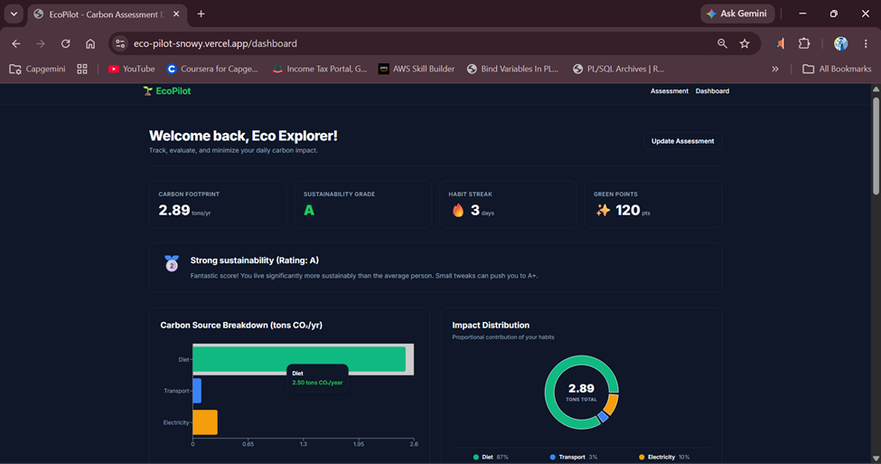
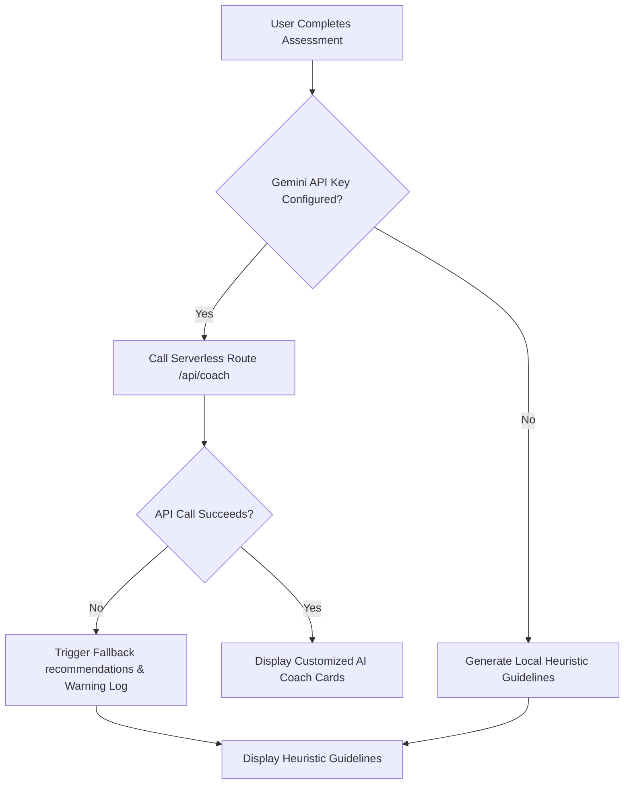
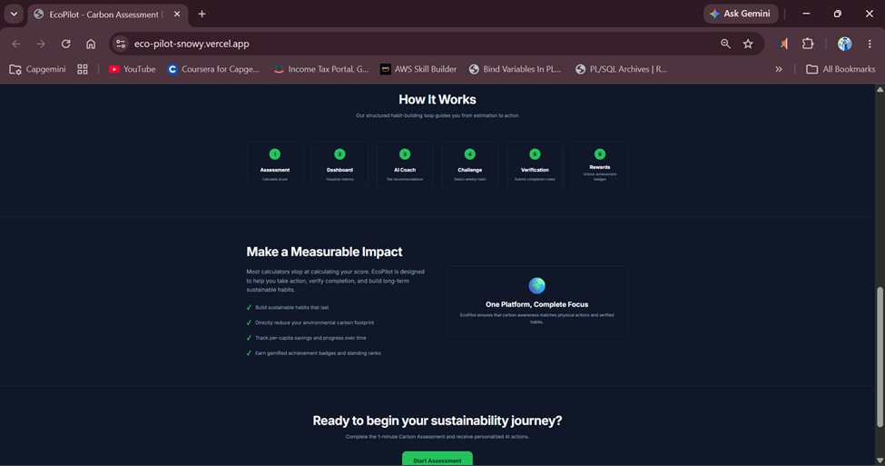
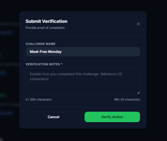
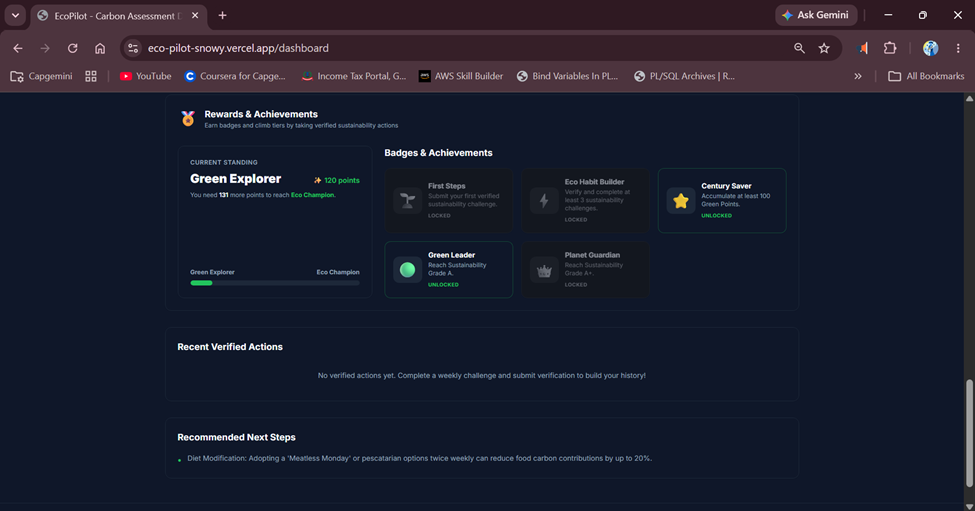

# EcoPilot 🌍

> AI-Powered Sustainability Guidance for Everyday Actions

## Live Demo

🔗 [https://eco-pilot-snowy.vercel.app](https://eco-pilot-snowy.vercel.app)

## Source Code

🔗 [https://github.com/Mitra-lab/EcoPilot](https://github.com/Mitra-lab/EcoPilot)

---

### Dashboard Overview


---

## ⚡ Quick Evaluation Flow

1. **Complete the Carbon Assessment**: Fill out the assessment with household details.
2. **Review your Sustainability Dashboard**: View proportional emissions breakdown charts and grades.
3. **Explore AI Sustainability Recommendations**: Examine personalized sustainability guidance using a local recommendation engine with optional Gemini 3.5 Flash enhancement.
4. **Complete a Personalized Weekly Challenge**: Select custom challenges aligned with your highest footprint categories.
5. **Submit Verification Notes**: Provide a written log of your actions (minimum 20 characters) to verify completion.
6. **Earn Green Points and Achievements**: Accumulate points, level up standing tiers, and unlock badges.

---

> [!NOTE]
> EcoPilot is a sustainability guidance platform focused on helping users understand, reduce, and improve their environmental impact through measurable actions, built with Next.js 15, TypeScript, and Tailwind CSS.

---

## 📊 Measurable Quality Metrics
- **61 Automated Tests Passing**: Comprehensive unit & integration test coverage across scoring, challenges, and rewards logic.
- **Unit & Integration Test Coverage Across Core Features**: Solid regression protection for key calculations and state transitions.
- **TypeScript Strict Mode**: Fully strongly-typed codebase with zero implicit `any` definitions.
- **Zod Validation**: Strict runtime schema enforcement for all user input forms and API requests.
- **AI Fallback System**: Seamless failover to a local rule-based heuristic recommendation engine if the Gemini API is offline or unconfigured.
- **Responsive UI**: Sleek dark-themed layout tailored with custom HSL values and styled for mobile, tablet, and desktop screens.
- **Production Build Verified**: Confirmed compile and optimization targets with zero warnings.

---

## 📖 Table of Contents
1. [Project Overview](#-project-overview)
2. [Why EcoPilot Matters](#-why-ecopilot-matters)
3. [Problem Statement](#-problem-statement)
4. [Solution Overview](#-solution-overview)
5. [Key Features](#-key-features)
6. [Application Workflow](#-application-workflow)
7. [Architecture](#-architecture)
8. [Architecture Diagram](#-architecture-diagram)
9. [Screenshots](#-screenshots)
10. [Technology Stack](#-technology-stack)
11. [Local Setup](#-local-setup)
12. [Deployment](#-deployment)
13. [AI Recommendation Engine](#-ai-recommendation-engine)
14. [Sustainability Scoring Engine](#-sustainability-scoring-engine)
15. [Verification & Rewards System](#-verification--rewards-system)
16. [Future Roadmap](#-future-roadmap)
17. [Future Enhancements](#-future-enhancements)
18. [Architecture Decisions](#-architecture-decisions)

---

## ⚡ Project Overview
EcoPilot is designed to walk the user through an integrated pipeline: estimating household carbon footprint, obtaining personalized AI-driven habit improvements, adopting target weekly challenges, verifying physical completion, and compiling verified sustainability rewards.

---

## 🌍 Why EcoPilot Matters
Climate change is driven by collective human activity, yet individuals often feel powerless to make a difference. Traditional carbon calculators leave users overwhelmed with global emissions data without showing them how their daily routines contribute. 

EcoPilot matters because it breaks down complex environmental footprints into achievable, bite-sized tasks. By guiding users through small, structured behavioral changes (like thermostat optimization, reducing red meat, or active commuting) and holding them accountability through verification, EcoPilot fosters genuine habit formation. When multiplied across households, these small actions drive measurable, cumulative carbon reductions.

---

## ⚠️ Problem Statement
Standard carbon footprint calculators stop at awareness. They calculate annual emission scores and display complex charts, leaving users feeling uncertain about what concrete steps to take next. Users struggle to:
- Translate raw CO₂ tons into actionable, daily choices.
- Maintain consistency and accountability without validation.
- Visualize micro-improvements over time in a motivating way.

---

## 💡 Solution Overview
EcoPilot bridges the awareness-to-action gap through:
1. **Interactive Assessment**: Calculates annual per-capita emissions.
2. **AI Sustainability Coach**: Generates personalized sustainability guidance using a local recommendation engine with optional Gemini 3.5 Flash enhancement.
3. **Actionable Challenges**: Weekly activities linked to the user's primary emission source.
4. **Verification Timelines**: Written completion logs that are validated before points are awarded.
5. **Achievement Badges**: Progress-tracked tiers (Eco Starter to Planet Guardian) and dynamic unlocked badges.

---

## ✨ Key Features
- **Carbon Assessment Wizard**: 1-minute wizard assessing household factors with automatic per-capita scaling.
- **AI Recommendation Engine**: Localized recommendation templates with Gemini-powered personalization overlays categorizing actions by difficulty, impact, and expected CO₂ savings.
- **Weekly Habits Checklist**: Targeted challenges for electricity conservation, clean transit, and vegetarian eating.
- **Audit Logs & History**: Self-verification modal enforcing character limits (min 20) with a history timeline.
- **Rewards System**: Gamified standings showing points milestones and badge lockers.

---

## 🔄 Application Workflow
1. **Landing Page**: User reads the value proposition and enters the platform.
2. **Onboarding Assessment**: Inputs family size, electricity bill, transit distance, vehicle engine, and diet.
3. **Analytics Dashboard**: Reviews proportional emissions charts, grades, and streaks.
4. **AI Coach Guidance**: Interacts with the coach to study custom impact recommendations.
5. **Habit Selection**: Starts target weekly challenges based on their highest emissions category.
6. **Submit Notes**: Completes tasks and submits verification logs.
7. **Earn Badges**: Collects points, climbs standing tiers, and unlocks reward badges.

---

## 🏗️ Architecture
EcoPilot is built using a clean, separation-of-concerns layout:
- **Presentation Layer**: Built with Next.js 15, TypeScript, Tailwind CSS, and shadcn/ui components. Presentation is strictly decoupled from business logic.
- **Business Logic Layer**: Centralized under `src/services/` (e.g., `carbon.ts`, `rewards.ts`, `challenge.ts`, `verification.ts`) for easier testing and maintenance.
- **Data Validation**: Strict runtime Zod schema parsing for all user payloads, forms, and environment structures.
- **State & Persistence**: Dynamic `localStorage`-backed engine simulating database behaviors to ensure mock-free resilience across page reloads.

For a detailed review of all Architectural Decision Records (ADRs), reliability plans, scalability migration roadmaps, and security schemas, see [ARCHITECTURE.md](./ARCHITECTURE.md).

---

## 📊 Architecture Diagram

The reliability strategy of the platform utilizes serverless coach routes with client fallback routing:



---

## 📸 Screenshots

### Landing Page




### Assessment Flow


### Dashboard Overview


### AI Sustainability Coach


### Weekly Habit Challenges


### Verification Workflow


### Rewards & Achievements


---

## 💻 Technology Stack
- **Framework**: Next.js 15 (App Router)
- **Language**: TypeScript (Strict Mode)
- **Styling**: Tailwind CSS & vanilla CSS variables
- **State & Persistence**: LocalStorage simulated persistence API
- **AI Layer**: Local Recommendation Engine + Optional Gemini 3.5 Flash Integration
- **Testing**: Jest (Unit/Integration) and Playwright (E2E framework ready)
- **Validation**: Zod (Runtime Schema Validation)

---

## ⚙️ Local Setup

1. **Install Dependencies**:
   ```bash
   npm install
   ```

2. **Configure Environment Variables**:
   Create a `.env.local` file:
   ```env
   GEMINI_API_KEY=your_gemini_api_key_here
   ```

3. **Start Development Server**:
   ```bash
   npm run dev
   ```

4. **Verify TypeScript & Build**:
   ```bash
   npx tsc --noEmit
   npm run build
   ```

---

## 🚀 Deployment
See [DEPLOYMENT.md](./DEPLOYMENT.md) for detailed deployment steps on Vercel and environment production keys configuration.

---

## 🤖 AI Recommendation Engine

### AI Sustainability Coach

#### Architecture
```text
Local Recommendation Engine
↓
Optional Gemini 3.5 Flash Integration
```

- **Local Recommendation Engine**: Works completely offline without any API keys, performing rule-based heuristic recommendations tailored to user profile details (e.g. Diet Preference, Vehicle Type, Travel Distance, Electricity Bill limits).
- **Optional Gemini 3.5 Flash Integration**: If `process.env.GEMINI_API_KEY` is unconfigured, undefined, or empty, the application immediately uses the local recommendation engine without initiating network requests to Gemini, preventing network latency and 403 Forbidden errors. Fallback behavior is intentional, and the production deployment currently operates safely without Gemini configuration.

---

## 🧮 Sustainability Scoring Engine
The scoring engine computes per-capita CO₂ footprint scores based on:
- **Electricity Usage**: Per-capita scaling based on monthly bills, electricity rates, and household family size.
- **Transportation**: Proportional engine mapping weekly miles against engine fuel categories (Gasoline, Diesel, Hybrid, Electric, or None).
- **Diet preferences**: Emission multipliers representing food production footprints from Meat Lover down to Vegan.

---

## 🏅 Verification & Rewards System
- **Written Log Verification**: Enforces textual submissions detailing how the challenge was performed (minimum 20 characters) before granting rewards.
- **Tier Standings**: Calculates points ranges across standing levels:
  - Eco Starter (0-100 Points)
  - Green Explorer (101-250 Points)
  - Eco Champion (251-500 Points)
  - Planet Guardian (501+ Points)
- **Badge Locker**: Tracks and unlocks 5 unique achievement badges based on points milestones, verification count, and assessment grades.

---

## 🗺️ Future Roadmap
- **Photo & OCR Evidence Verification**: Integrate Gemini Multimodal API to verify photo uploads and utility bills.
- **Supabase PostgreSQL Persistence**: Fully connect Auth and RLS policies for global leaderboards.
- **Community Teams**: Group challenges and collective carbon offset trackers.
- See [ROADMAP.md](./ROADMAP.md) for additional release timelines.

---

## 🚀 Future Enhancements
- **Cloud Persistence**: Sync local progress to cloud tables to ensure accessibility across devices.
- **User Accounts**: Create multi-user household profiles to synchronize domestic footprint tracking.
- **AI-Powered Verification**: Deploy vision-model audits verifying image uploads (like recycling bins or transit receipts).
- **Community Challenges**: Team-based sustainability goals and cooperative offset tasks.
- **Sustainability Analytics**: Track month-over-month carbon savings with advanced comparative charts.

---

## 🛠️ Architecture Decisions (ADR)
Detailed architectural decision records can be reviewed in [ARCHITECTURE.md](./ARCHITECTURE.md):
- **ADR 1**: Client `localStorage` chosen for offline resilience and zero cold-start latency.
- **ADR 2**: Fallback recommendations engine implemented for absolute service reliability.
- **ADR 3**: Optional Gemini API key dependency to make evaluation accessible for reviewers.
- **ADR 4**: No Authentication barrier in MVP to allow immediate 30-second reviewer evaluations.

---

## Try EcoPilot

Experience personalized sustainability guidance:

🔗 [https://eco-pilot-snowy.vercel.app](https://eco-pilot-snowy.vercel.app)

