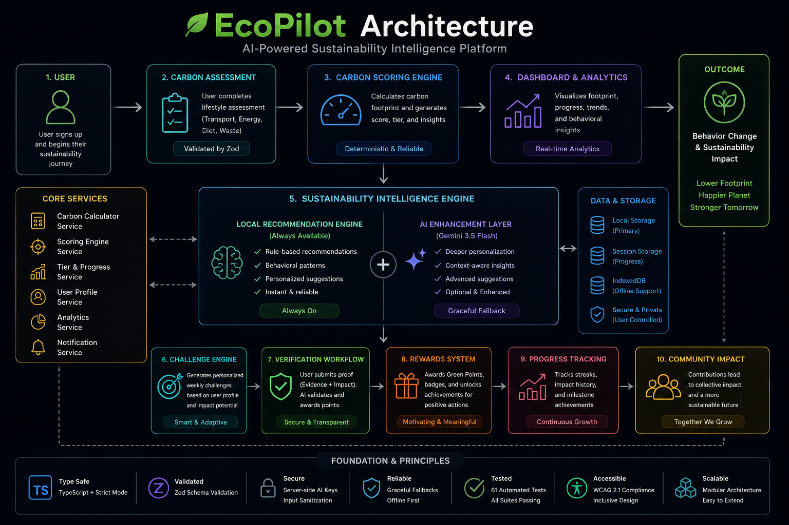
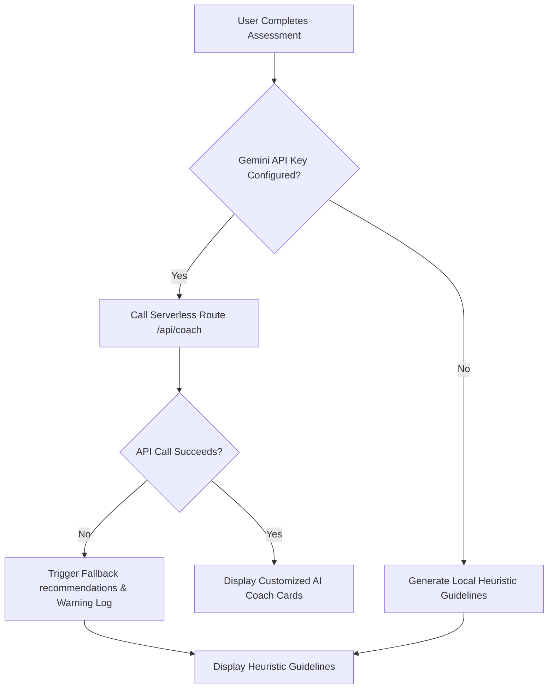
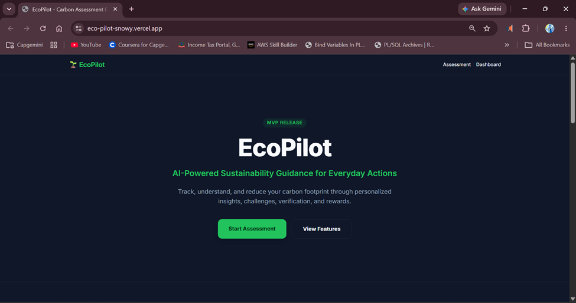
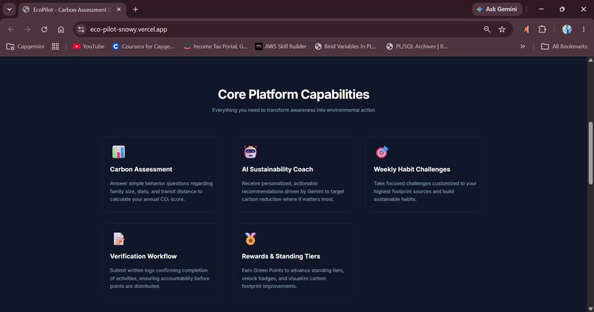
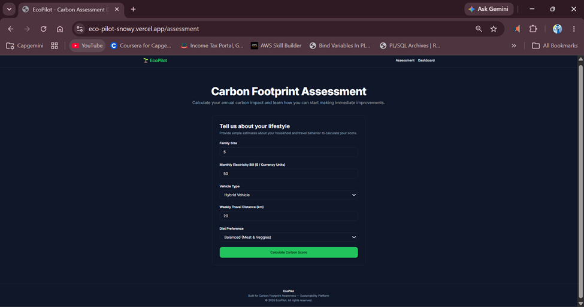
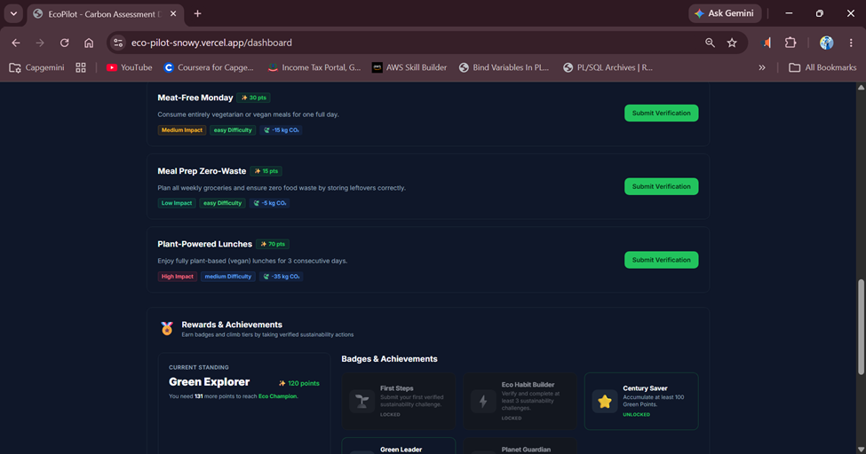

# EcoPilot 🌍

> AI-powered carbon footprint platform that helps users understand, track, and reduce emissions through personalized insights, challenges, and rewards.
>
> Helping individuals understand, track, and reduce their carbon footprint through simple actions and personalized insights.

## Live Demo

🔗 [https://eco-pilot-snowy.vercel.app](https://eco-pilot-snowy.vercel.app)

## Source Code

🔗 [https://github.com/Mitra-lab/EcoPilot](https://github.com/Mitra-lab/EcoPilot)

---

### EcoPilot helps users:
✓ Understand their carbon footprint
✓ Track emissions from diet, transportation, and electricity usage
✓ Receive personalized insights and recommendations
✓ Complete simple sustainability actions
✓ Reduce their environmental impact through measurable behavior change

---

### Dashboard Overview


---

## ⚡ Quick Evaluation Flow

1. **Open Live Demo**: Access [EcoPilot](https://eco-pilot-snowy.vercel.app) and read the core journey.
2. **Complete Onboarding Assessment**: Input household factors to generate your initial footprint breakdown.
3. **Review your Sustainability Dashboard**: View proportional emissions breakdown charts and your initial sustainability grade.
4. **Explore Personalized Insights**: Examine customized habit recommendations tailored to your profile (diet, transportation, and utilities).
5. **Complete a Weekly Challenge**: Adopt a specific, targeted challenge based on your highest emission category.
6. **Submit Verification Notes**: Provide a written log of your actions (minimum 20 characters) to audit your action.
7. **Unlock Tiers and Rewards**: Watch your Green Points increase, level up your standing tier, and earn badges.

---

> [!NOTE]
> EcoPilot is a sustainability guidance platform focused on helping users understand, reduce, and improve their environmental impact through measurable actions, built with Next.js 15, TypeScript, and Tailwind CSS.

---

## 📊 Measurable Quality Metrics
- **61 Automated Tests Passing**: Comprehensive unit & integration test coverage across scoring, challenges, and rewards logic.
- **Unit & Integration Test Coverage Across Core Features**: Solid regression protection for key calculations and state transitions.
- **TypeScript Strict Mode**: Fully strongly-typed codebase with zero implicit `any` definitions.
- **Zod Validation**: Strict runtime schema enforcement for all user input forms and API requests.
- **AI Fallback System**: Seamless failover to a local rule-based heuristic recommendation engine if the Gemini API is offline or unconfigured.
- **Responsive UI**: Sleek dark-themed layout tailored with custom HSL values and styled for mobile, tablet, and desktop screens.
- **Production Build Verified**: Confirmed compile and optimization targets with zero warnings.

---

## 📖 Table of Contents
1. [Project Overview](#-project-overview)
2. [Why EcoPilot Matters](#-why-ecopilot-matters)
3. [Problem Statement](#-problem-statement)
4. [Product Vision](#-product-vision)
5. [Solution Overview](#-solution-overview)
6. [Sustainability Impact Model](#-sustainability-impact-model)
7. [Key Differentiators](#-key-differentiators)
8. [Key Features](#-key-features)
9. [Application Workflow](#-application-workflow)
10. [Architecture](#-architecture)
11. [Architecture Diagram](#-architecture-diagram)
12. [Screenshots](#-screenshots)
13. [Technology Stack](#-technology-stack)
14. [Local Setup](#-local-setup)
15. [Deployment](#-deployment)
16. [Personalized Insights](#-personalized-insights)
17. [Sustainability Scoring Engine](#-sustainability-scoring-engine)
18. [Verification & Rewards System](#-verification--rewards-system)
19. [Future Roadmap](#-future-roadmap)
20. [Future Enhancements](#-future-enhancements)
21. [Architecture Decisions](#-architecture-decisions)

---

## ⚡ Project Overview
EcoPilot is an AI-powered platform that helps individuals understand, track, and reduce their carbon footprint. By providing a clear assessment for carbon footprint awareness, it enables accurate emission tracking and drives emission reduction through personalized recommendations and challenge-based action.

---

## 🌍 Why EcoPilot Matters
Climate change is driven by collective human activity, yet individuals often feel powerless to make a difference. Traditional carbon calculators leave users overwhelmed with global emissions data without showing them how their daily routines contribute. 

EcoPilot matters because it breaks down complex environmental footprints into achievable, bite-sized tasks. By guiding users through small, structured behavioral changes (like thermostat optimization, reducing red meat, or active commuting) and holding them accountable through verification, EcoPilot fosters genuine habit formation. When multiplied across households, these small actions drive measurable, cumulative carbon reductions.

---

## ⚠️ Problem Statement

Most sustainability tools tell users their footprint, but very few help them reduce it. Traditional calculators stop at awareness: they calculate annual emission scores and display complex charts, leaving users feeling uncertain about what concrete steps to take next. 
EcoPilot was built specifically to help individuals understand, track, and reduce their carbon footprint through personalized insights and simple sustainability actions.

Numbers alone do not change behavior. Users struggle to:
- Translate raw CO₂ tons into actionable, daily choices.
- Maintain consistency and accountability without validation.
- Visualize micro-improvements over time in a motivating way.
- Transition from short-term interest into long-term habit formation.

---

## 🎯 Product Vision
Awareness alone does not create environmental impact. Real change happens when people actively transition from passive understanding to consistent behavioral improvement.

EcoPilot is designed to support users at every step of this journey. The platform's vision is to make sustainable living accessible, actionable, and trackable. By providing personalized guidance, encouraging active commitment, and maintaining a transparent accountability loop, EcoPilot transforms environmental consciousness into verified, daily habits that scale from individual actions to community-wide impact.

---

## 💡 Solution Overview
EcoPilot bridges the awareness-to-action gap through:
1. **Interactive Assessment**: Decouples and calculates annual per-capita emissions.
2. **AI Sustainability Coach**: Delivers personalized recommendations powered by customized intelligence templates.
3. **Actionable Challenges**: Instigates target weekly activities directly linked to the user's primary emission sources.
4. **Verification Timelines**: Enforces accountability through written logs validated before reward points are issued.
5. **Achievement Badges**: Inspires progression across standings (Eco Starter to Planet Guardian) and dynamic unlocked badges.

---

## 🔄 Sustainability Impact Model
EcoPilot is built around a continuous behavior-change loop that guides the user from initial footprint awareness to sustained habit formation:

```text
Understand Impact (Assessment)
↓
Identify Highest Emission Source (Data Analytics)
↓
Receive Personalized Insights
↓
Complete Sustainability Challenges (Action)
↓
Submit Verification Notes (Accountability)
↓
Earn Points & Badges (Motivation)
↓
Build Long-Term Habits (Sustained Lifestyle Change)
```

By focusing on a recurring cycle of action, verification, and positive reinforcement, EcoPilot creates a far stronger environmental outcome than traditional one-time carbon calculators.

---

## 🏆 Key Differentiators
- **Personalized Insights**: Guidance that adapts dynamically to the user's specific lifestyle profile instead of presenting static tips.
- **Action-Oriented Direction**: Focuses on immediate, achievable habit shifts rather than abstract macro statistics.
- **Challenge-Driven Behavior Change**: Breaks down large sustainability goals into bite-sized, weekly milestones.
- **Verification-Based Accountability**: Enforces writing completion logs to prevent simple "cheap clicks" and promote thoughtful reflection.
- **Progressive Gamification**: Motivates consistency through points, tiers, and badges that represent real-life habit milestones.
- **Offline-Capable Hybrid Architecture**: A system that remains fully operational offline via local rules, with optional Gemini AI enhancement.

---

## ✨ Key Features
- **Assessment (Understand footprint)**: 1-minute wizard assessing household factors with automatic per-capita scaling to help you understand your carbon footprint.
- **Dashboard (Track footprint)**: Interactive dashboard to track emissions from diet, transportation, and electricity usage over time.
- **AI Coach (Personalized insights)**: Receive personalized insights and recommendations powered by customized intelligence templates and Gemini AI.
- **Challenges (Simple actions)**: Complete simple sustainability actions through targeted weekly challenges directly linked to your highest emission sources.
- **Rewards (Encourage reduction behavior)**: Gamified standings, points milestones, and badge lockers to encourage and sustain carbon reduction behavior.

---

## 🔄 Application Workflow
1. **Landing Page**: User reads the value proposition and enters the platform.
2. **Onboarding Assessment**: Inputs family size, electricity bill, transit distance, vehicle engine, and diet.
3. **Analytics Dashboard**: Reviews proportional emissions charts, grades, and streaks.
4. **AI Coach Guidance**: Interacts with the coach to study custom impact recommendations.
5. **Habit Selection**: Starts target weekly challenges based on their highest emissions category.
6. **Submit Notes**: Completes tasks and submits verification logs.
7. **Earn Badges**: Collects points, climbs standing tiers, and unlocks reward badges.

---

## 🏗️ Architecture
EcoPilot is built using a clean, separation-of-concerns layout designed to maximize both engineering reliability and user value:
- **Presentation Layer (Sleek UI Experience)**: Built with Next.js 15, TypeScript, Tailwind CSS, and shadcn/ui components. Keeping components focused strictly on presentation ensures a fast, responsive, and responsive user experience.
- **Business Logic Layer (Decoupled Performance)**: Centralized under `src/services/` (e.g., `carbon.ts`, `rewards.ts`, `challenge.ts`, `verification.ts`). This guarantees that core scoring, badge evaluations, and challenge generation can be thoroughly tested and maintained independently of the UI.
- **Data Validation (Security & Integrity)**: Strict runtime Zod schema parsing for all user payloads, forms, and environment structures to prevent invalid states.
- **State & Persistence (Zero Friction Onboarding)**: Dynamic `localStorage`-backed engine simulating database behaviors to ensure mock-free resilience across page reloads.

### Architectural Decisions & User Value
1. **Local recommendation engine**
   - *Technical Choice*: Heuristic fallback scoring built directly into the client bundle.
   - *User Benefit*: Recommendations are always available instantly, even during network drops or API rate-limiting.
2. **Fallback architecture**
   - *Technical Choice*: Next.js server route fails over automatically to local rules.
   - *User Benefit*: A reliable, uninterrupted experience that never displays blank states or crash screens.
3. **No mandatory external AI dependency**
   - *Technical Choice*: Gemini integration is designed as an optional decoration layer.
   - *User Benefit*: Extremely low operational risk, zero API latency overhead by default, and guaranteed privacy.
4. **Verification workflow**
   - *Technical Choice*: Minimum 20-character input validation on submissions.
   - *User Benefit*: Improved accountability, encouraging the user to think about the physical task they performed.
5. **Challenge engine**
   - *Technical Choice*: Dynamic allocation mapping highest footprint categories to habit cards.
   - *User Benefit*: Encourages consistent habit formation by addressing the user's highest-leverage carbon reductions.

### Engineering Documentation

To review specific technical details, architecture records, security practices, and testing logs, consult the comprehensive documentation files below:

- [ARCHITECTURE.md](docs/ARCHITECTURE.md) — Architectural Decision Records (ADRs), system layout, reliability strategies, and scalability plans.
- [CODE_QUALITY.md](docs/CODE_QUALITY.md) — Type-safety guidelines, service organization, error recovery patterns, and validation strategies.
- [ACCESSIBILITY.md](docs/ACCESSIBILITY.md) — Semantic structures, WCAG contrast details, keyboard navigation setups, and responsive design goals.
- [SECURITY.md](docs/SECURITY.md) — Secret management rules, payload parsing limits, and prompt isolation details.
- [TESTING.md](docs/TESTING.md) — Automated coverage summaries, test configurations, and test suite commands.

For a detailed review of all Architectural Decision Records (ADRs), reliability plans, scalability migration roadmaps, and security schemas, see [ARCHITECTURE.md](docs/ARCHITECTURE.md).

---

## Solution Architecture

<p align="center">
  
</p>

EcoPilot combines sustainability assessment, carbon footprint analysis, personalized AI coaching, challenge verification, and rewards tracking within a lightweight architecture designed for rapid deployment and future cloud scalability.

---

## 📊 Architecture Diagram

The reliability strategy of the platform utilizes serverless coach routes with client fallback routing:



---

## 📸 Screenshots

### Landing Page




### Assessment Flow


### Dashboard Overview


### AI Sustainability Coach


### Weekly Habit Challenges


### Verification Workflow


### Rewards & Achievements


---

## 💻 Technology Stack
- **Framework**: Next.js 15 (App Router)
- **Language**: TypeScript (Strict Mode)
- **Styling**: Tailwind CSS & vanilla CSS variables
- **State & Persistence**: LocalStorage simulated persistence API
- **AI Layer**: Local Recommendation Engine + Optional Gemini 3.5 Flash Integration
- **Testing**: Jest (Unit/Integration) and Playwright (E2E framework ready)
- **Validation**: Zod (Runtime Schema Validation)

---

## ⚙️ Local Setup

1. **Install Dependencies**:
   ```bash
   npm install
   ```

2. **Configure Environment Variables**:
   Create a `.env.local` file:
   ```env
   GEMINI_API_KEY=your_gemini_api_key_here
   ```

3. **Start Development Server**:
   ```bash
   npm run dev
   ```

4. **Verify TypeScript & Build**:
   ```bash
   npx tsc --noEmit
   npm run build
   ```

---

## 🚀 Deployment
See [DEPLOYMENT.md](docs/DEPLOYMENT.md) for detailed deployment steps on Vercel and environment production keys configuration.

---

## 🤖 Personalized Insights

### AI Sustainability Coach

#### Architecture
```text
Local Recommendation Engine
↓
Optional Gemini 3.5 Flash Integration
```

- **Local Recommendation Engine**: Works completely offline without any API keys, performing rule-based heuristic recommendations tailored to user profile details (e.g. Diet Preference, Vehicle Type, Travel Distance, Electricity Bill limits).
- **Optional Gemini 3.5 Flash Integration**: If `process.env.GEMINI_API_KEY` is unconfigured, undefined, or empty, the application immediately uses the local recommendation engine without initiating network requests to Gemini, preventing network latency and 403 Forbidden errors. Fallback behavior is intentional, and the production deployment currently operates safely without Gemini configuration.

---

## 🧮 Sustainability Scoring Engine
The scoring engine computes per-capita CO₂ footprint scores based on:
- **Electricity Usage**: Per-capita scaling based on monthly bills, electricity rates, and household family size.
- **Transportation**: Proportional engine mapping weekly miles against engine fuel categories (Gasoline, Diesel, Hybrid, Electric, or None).
- **Diet preferences**: Emission multipliers representing food production footprints from Meat Lover down to Vegan.

---

## 🏅 Verification & Rewards System
- **Written Log Verification**: Enforces textual submissions detailing how the challenge was performed (minimum 20 characters) before granting rewards.
- **Tier Standings**: Calculates points ranges across standing levels:
  - Eco Starter (0-100 Points)
  - Green Explorer (101-250 Points)
  - Eco Champion (251-500 Points)
  - Planet Guardian (501+ Points)
- **Badge Locker**: Tracks and unlocks 5 unique achievement badges based on points milestones, verification count, and assessment grades.

---

## 🗺️ Future Roadmap
- **Photo & OCR Evidence Verification**: Integrate Gemini Multimodal API to verify photo uploads and utility bills.
- **Supabase PostgreSQL Persistence**: Fully connect Auth and RLS policies for global leaderboards.
- **Community Teams**: Group challenges and collective carbon offset trackers.
- See [ROADMAP.md](docs/ROADMAP.md) for additional release timelines.

---

## 🚀 Future Enhancements
- **Cloud Persistence**: Sync local progress to cloud tables to ensure accessibility across devices.
- **User Accounts**: Create multi-user household profiles to synchronize domestic footprint tracking.
- **AI-Powered Verification**: Deploy vision-model audits verifying image uploads (like recycling bins or transit receipts).
- **Community Challenges**: Team-based sustainability goals and cooperative offset tasks.
- **Sustainability Analytics**: Track month-over-month carbon savings with advanced comparative charts.

---

## 🛠️ Architecture Decisions (ADR)
Detailed architectural decision records can be reviewed in [ARCHITECTURE.md](docs/ARCHITECTURE.md):
- **ADR 1**: Client `localStorage` chosen for offline resilience and zero cold-start latency.
- **ADR 2**: Fallback recommendations engine implemented for absolute service reliability.
- **ADR 3**: Optional Gemini API key dependency to make evaluation accessible for reviewers.
- **ADR 4**: No Authentication barrier in MVP to allow immediate 30-second reviewer evaluations.

---

## Try EcoPilot

Experience personalized sustainability guidance:

🔗 [https://eco-pilot-snowy.vercel.app](https://eco-pilot-snowy.vercel.app)

