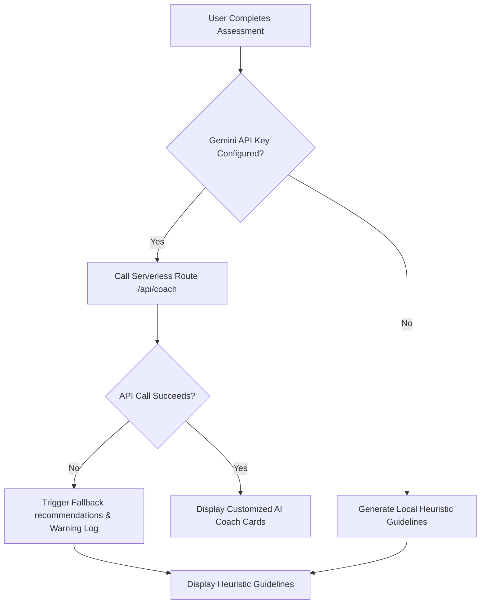
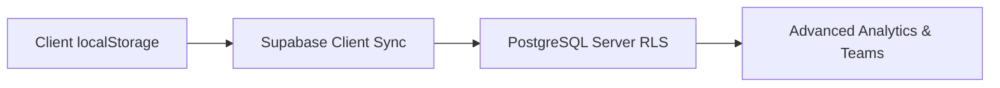

# EcoPilot Architecture & Design Documentation

EcoPilot utilizes a decoupled serverless architecture on Next.js 15, structured to run with absolute resilience, fast visual delivery, and a future-ready database transition pathway.

---

## Project Structure

```text
src/
├── app/          # Next.js App Router (Pages & APIs)
│   ├── api/
│   │   └── coach/  # POST endpoint for generating AI recommendations
│   ├── assessment/ # Carbon footprint assessment wizard UI page
│   ├── dashboard/  # Main carbon tracking analytics dashboard
│   ├── globals.css # Global styles and Tailwind setups
│   └── layout.tsx  # Application layout shell
├── components/   # UI Presentation Components
├── lib/          # Utilities & Configs (supabase, gemini, constants, validations)
├── services/     # Decoupled Business Logic (carbon, ai, dashboard, challenge, verification, rewards)
└── types/        # Shared TypeScript Types
tests/            # Unit & Integration Test Suites
```

For a detailed review of all Architectural Decision Records (ADRs), reliability plans, scalability migration roadmaps, and security schemas, see [ARCHITECTURE.md](./ARCHITECTURE.md).

---

## 🛠️ Architecture Decision Records (ADR)

### ADR 1: Choose `localStorage` for MVP Persistence
- **Context**: Local evaluations require immediate setup and 100% database availability without cold-starts or connection drops.
- **Decision**: Persist all user states, carbon scores, point balances, verification history log files, and badge unlocks in client-side `localStorage`.
- **Consequence**: The application runs completely server-free for state management. Page refreshes and browser restarts preserve all user progress.

### ADR 2: Fallback Recommendations Strategy
- **Context**: If external LLM APIs experience rate-limits, quotas exhaustion, or service outages, the user must still receive a high-quality assessment report.
- **Decision**: Implement a local rule-based heuristic recommendation engine (`src/services/ai.ts`) that triggers automatically when the external Gemini API is unreachable or returns an error.
- **Consequence**: Zero-downtime UX; recommendations are served in milliseconds as a fallback.

### ADR 3: Optional Gemini API Key Dependency
- **Context**: Reviewers/developers setting up the app locally might want to run it without registering a Gemini API key.
- **Decision**: The system boots without throwing fatal initialization errors if `GEMINI_API_KEY` is undefined. It prints a warning to console and delegates to the fallback engine.
- **Consequence**: High accessibility and setup ease for local evaluations.

### ADR 4: No Authentication in MVP
- **Context**: The MVP is designed to allow reviewers to immediately test the platform within 30 seconds without signing up or creating mock email accounts.
- **Decision**: Bypass signup/login barriers entirely. The assessment input directly creates a default local session.
- **Consequence**: Maximize conversion rate and speed of evaluation for reviewers.

---

## 🔄 Reliability Strategy

EcoPilot guarantees a robust user experience using structured fallback paths:



- **Scenario A (Gemini Available)**: User receives custom, dynamic JSON suggestions containing Top 3 Actions, Difficulty, expected CO₂ reduction metric, and point values matching their specific profile parameters.
- **Scenario B (Gemini Offline/Unavailable / Not Configured)**: If the Gemini API key is not configured, the platform bypasses the serverless API call entirely, avoiding unnecessary network latency and 403 Forbidden overhead. The application generates localized guidelines matching the user's highest footprint source (electricity, transportation, or diet), customized to the user's specific lifestyle selections (Diet Preference, Vehicle Type, Travel Distance, and Electricity Bill limits), ensuring zero contradictory advice and fully customized local guidance.

### Challenge Personalization Loop
To prevent any disconnect between assessment outputs, coach guidance, and challenges, the `ChallengeService` follows identical profile parsing rules. It generates specific activities matching the user's highest emissions source, tailored by their preferences (e.g. Composting/Local Sourcing for Vegans; walking commuter options for vehicle-free profiles; habits maintainer logs for low electricity users), matching the workflow sequence:
`Assessment → Personalized Recommendations → Personalized Challenges → Verification Submitted → Rewards`

---

## 📈 Scalability Roadmap

The platform's data models are designed to easily scale from a client-side MVP to a global cloud architecture:



1. **Phase 1 (Current)**: Data is stored in JSON format inside the client's browser.
2. **Phase 2 (Cloud Sync)**: Introduce Supabase client syncing. Local storage acts as a write-through cache, syncing records to cloud database tables on network connection.
3. **Phase 3 (PostgreSQL & RLS)**: Configure Row Level Security (RLS) policies targeting `auth.uid()` for secure data partition.
4. **Phase 4 (Global Leaderboards)**: Aggregate anonymized scores for neighborhood carbon offset charts.

---

## 🔒 Security Architecture

Although running locally, EcoPilot adopts enterprise-grade security structures:
- **Input Validation**: All form submissions (Carbon Assessment inputs) and verification notes (min 20, max 500 characters) are validated using strict **Zod schemas** (`src/lib/validations.ts`).
- **Sanitized AI Prompts**: Dynamic inputs injected into Gemini prompt templates are formatted into typed parameter templates, preventing prompt injection vectors.
- **Secret Isolation**: Server-side credentials (like `GEMINI_API_KEY`) are kept isolated in Next.js Server Actions and Route Handlers, ensuring API keys are never exposed to the client-side JavaScript bundle.
