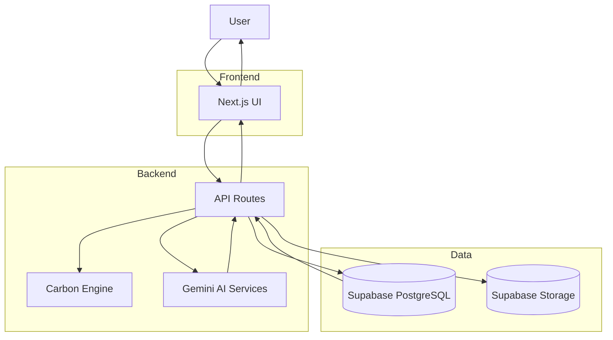

```mermaid
flowchart TB

    User[User]

    subgraph Frontend
        UI[Next.js UI]
    end

    subgraph Backend
        API[API Routes]
        Carbon[Carbon Engine]
        AI[Gemini AI Services]
    end

    subgraph Data
        DB[(Supabase PostgreSQL)]
        Storage[(Supabase Storage)]
    end

    User --> UI

    UI --> API

    API --> Carbon
    API --> AI

    API --> DB
    API --> Storage

    AI --> API

    DB --> API

    API --> UI

    UI --> User
```
