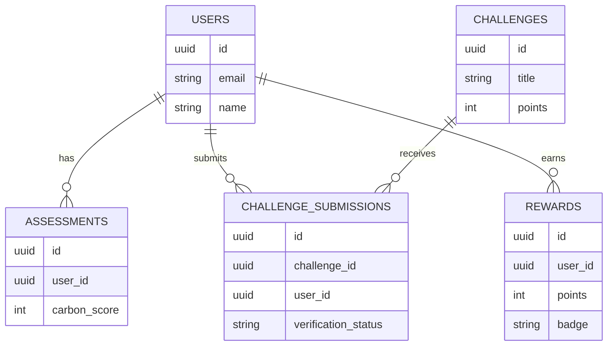

```mermaid
erDiagram

    USERS ||--o{ ASSESSMENTS : has

    USERS ||--o{ CHALLENGE_SUBMISSIONS : submits

    USERS ||--o{ REWARDS : earns

    CHALLENGES ||--o{ CHALLENGE_SUBMISSIONS : receives

    USERS {
        uuid id
        string email
        string name
    }

    ASSESSMENTS {
        uuid id
        uuid user_id
        int carbon_score
    }

    CHALLENGES {
        uuid id
        string title
        int points
    }

    CHALLENGE_SUBMISSIONS {
        uuid id
        uuid challenge_id
        uuid user_id
        string verification_status
    }

    REWARDS {
        uuid id
        uuid user_id
        int points
        string badge
    }
```
